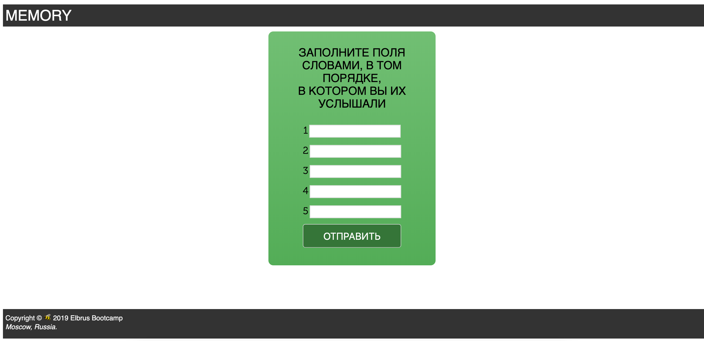

# MEMORY
Memory - это приложение по тестированию памяти.



## Getting started
```npm install``` <br>
```nodemon or npm start```

## MVP Functionality
- запоминание произносимых слов в указанном порядке
- заполнение слов в порядке их воспроизведения
- вывод результатов тестирования на экран

## Authors
[Анита Янтикова] (https://github.com/AnitaJD)
[Ольга Никитина] (https://github.com/Olya-Nik)
[Андрей Кроликов] (https://github.com/krolikovAA)
[Игорь Губанов] (https://github.com/GubanovIgor)

## Next Steps
Добавить дополнительные функции

## Contributing
We conform to the AirBnB JavaScript Style Guide

